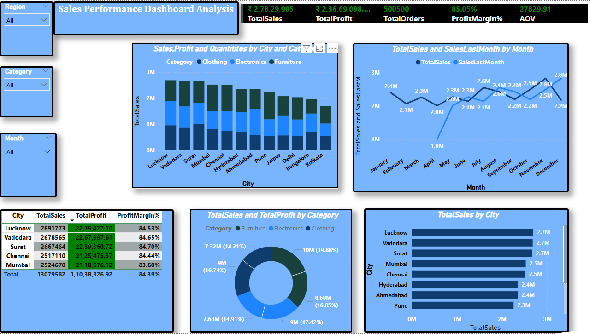

# 📊 Power BI Sales Performance Analysis Dashboard

Sales distribution analysis across various states and cities of India.

---

## 📌 Project Overview

This project presents a **Sales Performance Analysis Dashboard** designed to analyze and visualize key business metrics (KPIs), including:

- Total Sales  
- Total Profit  
- Profit Margin (%)  
- Total Orders  
- Average Order Value (AOV)  

The dashboard provides insights across multiple dimensions such as **cities, regions, categories, and time periods**, enabling a comprehensive understanding of business performance.

---

## 🎯 Project Objective

The primary objective of this project is to:

- Analyze top-performing **regions, cities, categories, and states** across India  
- Identify areas with declining **sales and profit trends**  
- Help stakeholders make **timely and data-driven decisions**  
- Support business expansion by highlighting **growth opportunities and weak areas**

---

## 🚀 Key Features

- 📊 **KPI Dashboard**
  - Displays Total Sales, Total Profit, Orders, Profit Margin %, and AOV  

- 🌍 **Regional & City Analysis**
  - Compare performance across different cities and regions  

- 🛍️ **Category Insights**
  - Analyze sales distribution across product categories (Clothing, Electronics, Furniture)  

- 📅 **Monthly Trend Analysis**
  - Track sales trends and compare with previous months  

- 🎛️ **Interactive Filters**
  - Region filter  
  - Category filter  
  - Month filter  

---

## 🖼️ Dashboard Preview

> *(Make sure your image file is named `dashboard.png` or update the path accordingly.)*

---

## 🛠️ Tools & Technologies

- **Power BI** – Data visualization and dashboard creation  
- **Microsoft Excel / CSV** – Data source *(update if different)*  

---

## 📈 Insights

- Top-performing cities include **Lucknow, Vadodara, and Surat**  
- Profit margins are consistently high (~84%)  
- Sales trends show fluctuations across months, indicating seasonality  
- Balanced contribution from multiple product categories  

---

## 📂 Project Structure
│── dashboard.png
│── dataset.csv
│── README.md

---

## ▶️ How to Use

1. Download or clone this repository  
2. Open the `.pbix` file in Power BI  
3. Use filters (Region, Category, Month) to explore the dashboard  

---

## 🔮 Future Improvements

- Add sales forecasting  
- Implement customer segmentation  
- Enable real-time data updates  
